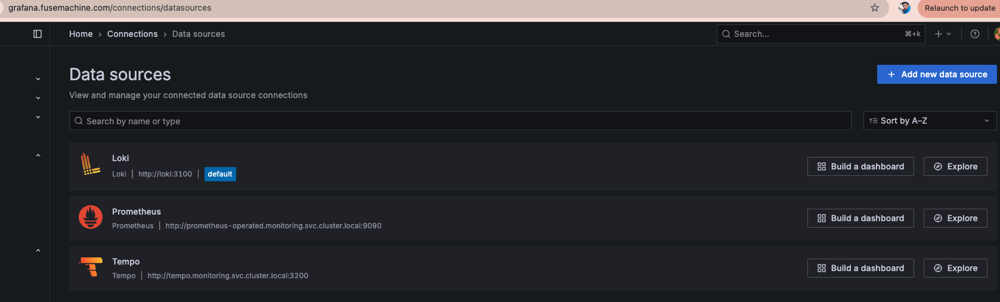
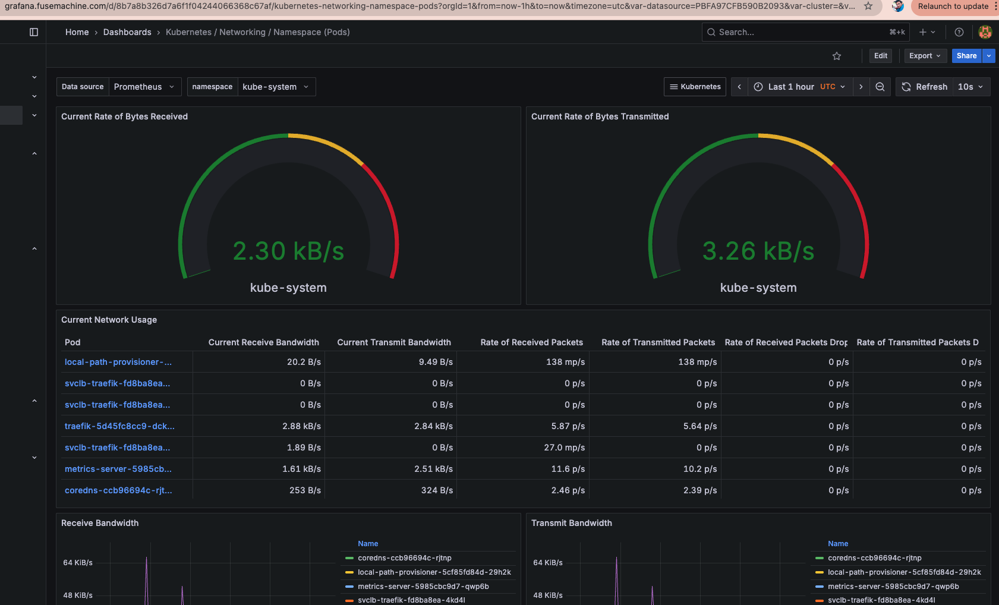
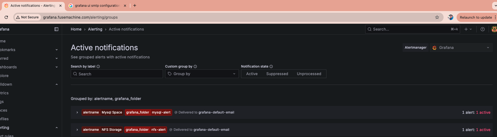
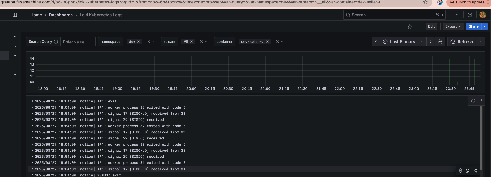

# Monitoring, Logging, and Alerting Implementation Report

---

## 1. Introduction

This document outlines the setup and configuration of end-to-end observability for the platform to ensure application reliability and proactive issue detection. The observability stack includes:

- **Prometheus** for metrics monitoring
- **Grafana** for visualization and alert management
- **Loki** for centralized logging
- **Tempo** for distributed tracing

The key focus areas include monitoring infrastructure components such as MySQL and NFS servers, application health, and alerting on critical conditions.

---

## 2. Monitoring Setup

### 2.1 Prometheus Installation

The Prometheus stack was deployed using the official Helm chart with customized scrape configurations to monitor MySQL and NFS exporters in addition to Kubernetes cluster components.

#### Helm Commands

```bash
# Add Helm repositories and update
helm repo add prometheus-community https://prometheus-community.github.io/helm-charts
helm repo add grafana https://grafana.github.io/helm-charts
helm repo update

# Install Prometheus stack with custom configuration
helm install prometheus-stack prometheus-community/kube-prometheus-stack \
  --namespace monitoring --create-namespace -f values.yaml

# Install Loki stack for centralized logging
helm install loki grafana/loki-stack --namespace monitoring

# Install Tempo for distributed tracing
helm install tempo grafana/tempo --namespace monitoring
```
## Prometheus and Grafana Configuration
```bash
prometheus:
  prometheusSpec:
    additionalScrapeConfigs:
      - job_name: 'mysql-exporter'
        static_configs:
          - targets: ['172.21.0.8:9104']
      - job_name: 'node-exporter'
        static_configs:
          - targets: ['172.21.0.9:9100']

grafana:
  enabled: true
  datasources:
    datasources.yaml:
      apiVersion: 1
      datasources:
        - name: Prometheus
          type: prometheus
          access: proxy
          url: http://prometheus-operated.monitoring.svc.cluster.local:9090
          isDefault: false
        - name: Loki
          type: loki
          access: proxy
          url: http://loki.monitoring.svc.cluster.local:3100
          isDefault: false
        - name: Tempo
          type: tempo
          access: proxy
          url: http://tempo.monitoring.svc.cluster.local:3200
          isDefault: false

  adminPassword: "admin123"

persistence:
  enabled: true
  size: 10Gi
  storageClassName: "local-path"
```
## Infrastructure Components (Docker Compose)
For local or dev environments, infrastructure services are deployed via Docker Compose. These include MySQL, mysqld-exporter, NFS server, and node-exporter, connected on a shared network.
```bash
networks:
  k3d-net:
    external: true
    name: k3d-dev-cluster  # Replace with your actual network name

volumes:
  mysql-data:
  nfs-data:

services:
  mysql:
    image: mysql:8
    container_name: mysql2
    restart: always
    environment:
      MYSQL_ROOT_PASSWORD: rootpassword
      MYSQL_DATABASE: appdb
      MYSQL_ROOT_HOST: "%"
    ports:
      - "3306:3306"
    volumes:
      - mysql-data:/var/lib/mysql
      - ./init_db.sql:/docker-entrypoint-initdb.d/init_db.sql
    networks:
      - k3d-net

  mysqld-exporter:
    image: prom/mysqld-exporter:v0.15.1
    container_name: mysqld-exporter
    restart: always
    environment:
      DATA_SOURCE_NAME: exporter_user:exporter_password@(mysql:3306)/
    ports:
      - "9104:9104"
    depends_on:
      - mysql
    networks:
      - k3d-net
    volumes:
      - ./.my.cnf:/.my.cnf:ro

  nfs-server:
    image: itsthenetwork/nfs-server-alpine:latest
    container_name: nfs-server
    restart: always
    environment:
      SHARED_DIRECTORY: /exports
    volumes:
      - nfs-data:/exports
    ports:
      - "20490:2049"   # NFS port
      - "11110:111"    # rpcbind port (required)
    networks:
      - k3d-net

  node-exporter:
    image: prom/node-exporter:latest
    container_name: node-exporter
    restart: always
    ports:
      - "9100:9100"
    networks:
      - k3d-net
    volumes:
      - mysql-data:/host/var/lib/mysql:ro
      - nfs-data:/host/exports:ro
    command:
      - '--path.rootfs=/host'
```
## Datasource, Dashboards and Alerts
Prometheus for kubernetes, pod, mysql and nfs metrics
Loki for logs of application 
Tempo for tracing


### Dashboards
The Prometheus Helm stack includes dashboards for Kubernetes cluster and pod monitoring by default.
Custom logging dashboards were created in Grafana using the Loki data source with filters by namespace and container labels to ease troubleshooting.

Dashboards for kubernetes stack, pod, contianer MySQL and NFS monitor metrics including storage utilization.

### Alerts

Alerts are configured to monitor:

MySQL availability — triggers if storage > 40GB.

NFS storage utilization — triggers if available storage utilized above 40GB.

Alerts are firing correctly in Grafana based on the defined Prometheus alerting rules.

SMTP email alert notifications are pending configuration.


### Log Dashboard
Log dashboard is created to visulize and filter log of applications.


## Tracing with Tempo

Tempo is installed and configured as a data source in Grafana to enable distributed tracing.
Application instrumentation to send trace data (via OpenTelemetry or similar) is pending. Once done, detailed request flows and latency issues can be analyzed effectively.

## Summary and Next Steps

- Installed Prometheus, Loki, Tempo, and Grafana using Helm with custom scrape configurations for MySQL and NFS monitoring.
- Created dashboards for Kubernetes, MySQL, NFS metrics and Loki logs with filtering capabilities.
- Alerts for MySQL availability and NFS storage utilization below threshold are firing successfully.
### Next Steps
- Configure Alertmanager SMTP to enable email notifications on alert triggers.
- Instrument applications with OpenTelemetry to enable sending trace data to Tempo.